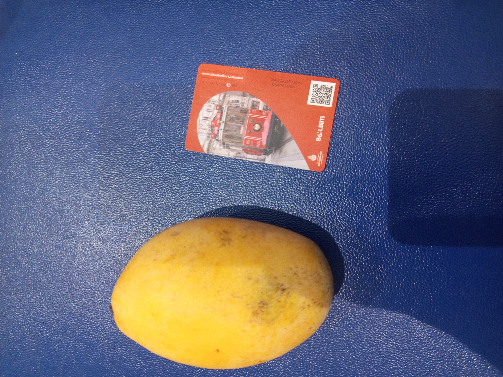
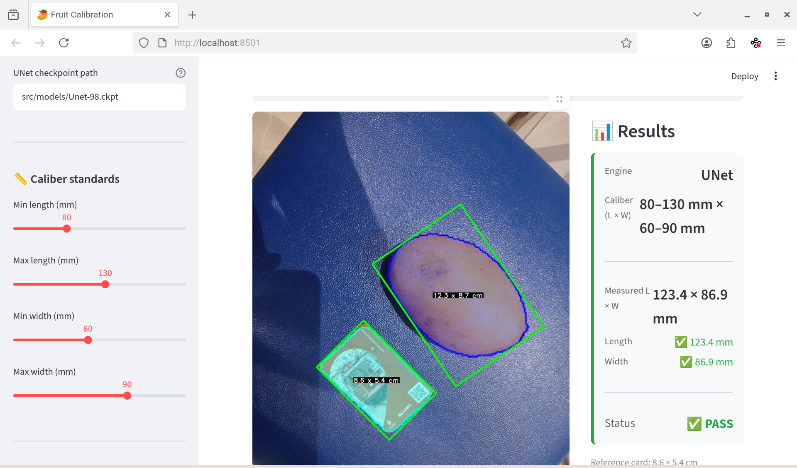

# Fruit Calibration – Mango Size Measurement

A computer vision tool that measures the length and width of a mango (in centimeters) using a red credit card as a scale reference.  
Supports both **HSV color filtering** and a **deep learning UNet model** for segmentation, with an interactive web interface.

  
*Figure 1: Original image with mango and red card*

  
*Figure 2: Detected objects with dimensions in cm*

---

## ✨ Features

- **Dual segmentation engines**: HSV color thresholding or trained UNet model.
- **Morphological cleaning** to refine masks (opening/closing).
- **Oriented bounding boxes** (`cv2.minAreaRect`) for precise length/width in pixels.
- **Automatic scaling** using a real credit card (85.6 mm × 53.98 mm).
- **Visual output**: filled contours, oriented rectangles, and dimensions in cm (white text on black background).
- **Web interface** built with Streamlit: upload images, adjust caliber standards, and switch segmentation modes in real time.
- **Modular object-oriented architecture** for easy extension (plug new segmentation engines).

---

## 📁 Project Structure

```
fruit_calibration/
├── app/
│   └── streamlit_app.py          # Web interface
├── src/
│   ├── segmentation/             # Segmentation engines
│   │   ├── base.py               # Abstract base class
│   │   ├── hsv_engine.py         # HSV color thresholding
│   │   ├── unet_engine.py        # UNet deep learning model
│   │   └── factory.py            # Engine factory
│   ├── dimension.py              # Pixel → cm conversion
│   ├── display.py                # Visualization
│   └── models/                   # Trained model checkpoints (optional)
├── data/                         # Test images
├── requirements.txt
├── main.py                       # CLI version (legacy)
└── README.md
```

---

## 🚀 Installation

### Requirements
- Python 3.8+
- OpenCV
- NumPy
- PyTorch (for UNet mode)
- Streamlit (for web interface)

Clone the repository and install dependencies:

```bash
git clone git@github.com:ihauss/fruit_calibration.git
cd fruit_calibration
pip install -r requirements.txt
```

For CPU-only PyTorch (no GPU):

```bash
pip install torch torchvision --index-url https://download.pytorch.org/whl/cpu
```

---

## 🖥️ Usage

### Web Interface (Streamlit) – **Recommended**



Launch the interactive web application:

```bash
streamlit run app/streamlit_app.py
```

Then open your browser at `http://localhost:8501`.

**In the interface you can**:
- Upload an image (JPG, PNG, JPEG).
- Switch between **HSV** and **UNet** segmentation engines.
- Adjust caliber standards (min/max length and width in mm).
- View the processed image with overlays and dimension labels.
- See real-time results: measured dimensions, pass/fail status, and reference card detection.

### Command Line (Legacy)

For batch processing or headless usage:

```bash
python main.py
```

This will process a hardcoded image (modify the path in `main.py`), display the result in an OpenCV window, and exit when `q` is pressed.

---

## 🔧 Configuration

### Adjust HSV Parameters

Edit the HSV ranges in `src/segmentation/hsv_engine.py`:

```python
mango_lower=(10, 50, 50)
mango_upper=(50, 255, 255)
card_lower1=(0, 50, 50)
card_upper1=(10, 255, 255)
card_lower2=(170, 50, 50)
card_upper2=(179, 255, 255)
```

### Use a Custom Reference Card

Modify the card dimensions in `src/dimension.py`:

```python
CARD_LONGUEUR_CM = 8.56    # your card's length in cm
CARD_LARGEUR_CM  = 5.398   # your card's width in cm
```

Or pass custom dimensions when instantiating `DimensionCalculator`:

```python
dim_calc = DimensionCalculator(card_length_cm=8.5, card_width_cm=5.4)
```

### Train Your Own UNet Model

If you want to use the UNet engine, you need a trained model checkpoint. Place your `.ckpt` file in `src/models/` and specify the path in the Streamlit interface or when creating the engine:

```python
engine = SegmentationFactory.create(
    engine_type="unet",
    checkpoint_path="src/models/Unet-98.ckpt"
)
```

There is already a version trained on a very limited dataset: [Training](https://colab.research.google.com/drive/1Lhw5cdu7xDCGVorPA9RihcuLFLijX6jO?usp=sharing)

---

## 🏗️ How It Works

1. **Segmentation**  
   - **HSV mode**: Color thresholding isolates yellow (mango) and red (card) regions.  
   - **UNet mode**: A trained convolutional neural network predicts pixel‑wise class labels (background, mango, card).  
   Both engines return binary masks for mango and card.

2. **Contour Extraction**  
   The largest external contour from each mask is extracted and cleaned using morphological operations.

3. **Pixel Dimensions**  
   `cv2.minAreaRect` computes the oriented bounding rectangle.  
   The longer side is the **length**, the shorter side is the **width** (in pixels).

4. **Real‑World Conversion**  
   The reference card's real size (in cm) is used to compute scale factors (pixels per cm) for both length and width.  
   These factors are applied to the mango's pixel dimensions to obtain measurements in centimeters.

5. **Visualization**  
   - Filled contours (semi‑transparent) with crisp outlines.  
   - Oriented bounding rectangles.  
   - Centered labels showing `L x W` in cm (white text on black background).

---

## 📊 Caliber Standards

In the Streamlit interface, you can define acceptable ranges for mango dimensions (in mm):
- Minimum / maximum length  
- Minimum / maximum width  

The system then displays a **PASS** or **FAIL** status based on whether the measured dimensions fall within these ranges.

---

## 🔮 Future Improvements

- **Segment Anything Model (SAM)** integration for zero‑shot segmentation of any fruit.
- **3D thickness estimation** using monocular depth models (e.g., MiDaS).

---

## 📄 License

This project is open‑source and available under the [MIT License](LICENSE).

---

## 👤 Author

**Ismael Hauss** – [ismael.hauss@gmail.com](mailto:ismael.hauss@gmail.com)  
GitHub: [ihauss](https://github.com/ihauss)
Website: [hauss-vision](https://www.hauss-vision.com/)
