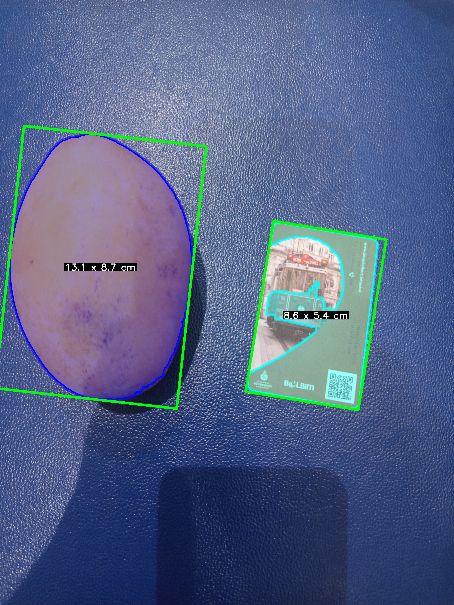

# Fruit Calibration – Mango Size Measurement

A computer vision tool that measures the length and width of a mango (in centimeters) using a red credit‑card as a scale reference.  
The segmentation is based on HSV color filtering, and the results are displayed directly on the image.


*Figure 1: Original image with mango and red card*


*Figure 2: Detected objects with dimensions in cm*

## Features

- **HSV segmentation** for a yellow mango and a red card.
- **Morphological opening** to clean the masks.
- **Oriented bounding boxes** (`cv2.minAreaRect`) to get precise length/width in pixels.
- **Automatic scaling** using a real credit‑card size (85.6 mm × 53.98 mm).
- **Visual output** – rectangles, filled masks, and dimensions in cm (white text on black background, centered).

## Project Structure

```
fruit_calibration/
├── src/
│   ├── segment_color.py      # HSV masks + contour extraction
│   ├── dimension.py          # bounding boxes, pixel dimensions
│   └── display.py     # drawing functions (rectangles, text)
├── data/                    # (optional) your test images
├── requirements.txt
├── main.py                  # main loop (load image, process, display)
├── .gitignore
└── README.md
```

## Requirements

- Python 3.8+
- OpenCV
- NumPy

Install the dependencies:

```bash
pip install -r requirements.txt
```

## Usage

1. **Place your image** in the `data/` folder (or modify the path inside `main.py`).  
   The image must contain a yellow mango and a red credit card (or any red card of standard size).  
   The card should be placed next to the fruit and clearly visible.

2. **Run the script** from the project root:

```bash
python src/main.py
```

3. **Interactive window**:
   - The processed image will be shown with the mango and card outlined.
   - Their dimensions (in cm) appear centered on each object.
   - Press `q` to quit the window.

## How It Works

1. **Segmentation** – HSV thresholds isolate the yellow mango (hue 20‑30) and the red card (hue 0‑10 and 170‑179).  
   A morphological opening removes small artefacts.

2. **Contour extraction** – The largest contour from each mask is kept.

3. **Pixel dimensions** – `cv2.minAreaRect` gives an oriented rectangle; `max(width, height)` is the length, the other is the width.

4. **Real‑world conversion** – The card’s real dimensions are known (8.56 cm × 5.398 cm).  
   Scale factors (pixels per cm) are computed separately for length and width.

5. **Display** – The oriented rectangles are drawn, and each dimension text is placed at the object’s centre (white on a black adaptive background).

## Customisation

- **Adjust HSV ranges** – If your mango is greener or your card has a different red shade, edit `lower/upper` arrays inside `segmentation.py`.
- **Card size** – Change `CARD_LONGUEUR_CM` and `CARD_LARGEUR_CM` in `conversion.py` to match your actual reference card.
- **Kernel size** – The morphological kernel (currently 25×25) can be changed in `segmentation.py` to better suit your image resolution.

## Future Improvements

- **General‑purpose segmentation** – Replace HSV with [SAM (Segment Anything Model)](https://github.com/facebookresearch/segment-anything) to handle any fruit or variable lighting.
- **3D thickness** – Integrate monocular depth estimation (e.g., MiDaS) to compute the mango’s thickness (third dimension).

## License

This project is open‑source and available under the MIT License.

## Author

[Ismael Hauss] – [ismael.hauss@gmail.com]  
GitHub: [ihauss](https://github.com/ihauss)
